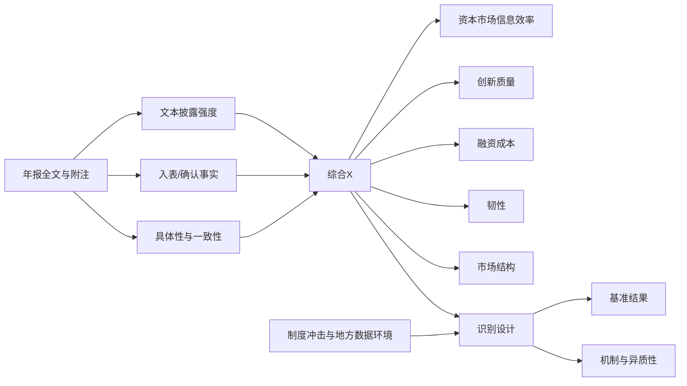
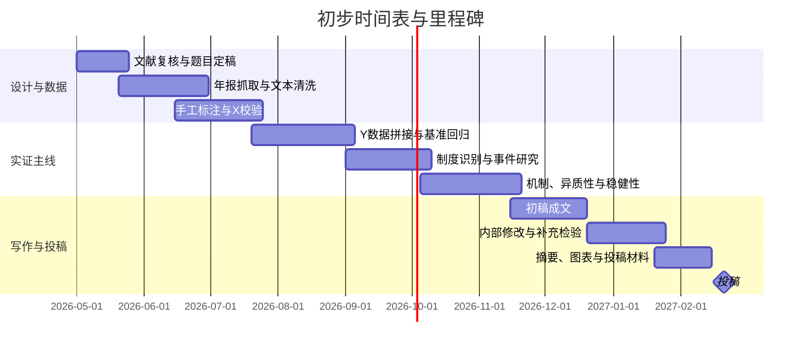

# 以年报数据要素披露为自变量的特刊选题深研

## 执行摘要

Economic Modelling 的特刊 “Artificial Intelligence, Data Investment and the Digital Economy” 已于 2026 年 4 月 1 日开放投稿，截止日期为 2027 年 2 月 28 日；其官方征稿范围明确覆盖数据作为资产、AI 与生产率、R&D 与创新回报、金融市场与金融稳定、经济韧性、加成率与市场结构、数据监管与竞争政策等主题。与此同时，国内在 2023—2024 年连续推出数据资源会计处理暂行规定、数据资产管理指导意见以及“数据要素×”三年行动计划，并且数据安全法、个人信息保护法已经构成了数据开发与披露的制度边界，这使得以年报为入口研究企业“数据要素披露”拥有很强的制度识别价值与现实相关性。citeturn35search0turn35search1turn5view0turn5view3turn36search0turn6search3turn5view2

但真正关键的判断是：**“X=年报中的数据要素披露”这个方向，已经不再是完全空白；广义、宽口径的 Y 正在被迅速填满。** 2024—2026 年的直接文献已经做到资本市场定价效率中的股价同步性、特质波动与错定价，也做到银行信贷、投资效率、创新投入与产出、供应链风险，甚至已经开始延伸到债券信用利差与成本债务。相邻的“企业数字化转型/数字化披露”文献则已经拥挤地覆盖了资本市场透明度、分析师预测、投资效率、TFP、韧性、GVC 升级、股权/债务融资成本等。基于这一文献密度，我的结论是：**你现在最值得做的，不是再做一个“X 提升了企业绩效”的宽题，而是把 Y 收窄到更具机制辨识度、更贴合特刊主题、且尚未被直接文献充分覆盖的结果变量。** citeturn34search0turn8search7turn4view1turn4view2turn24search1turn32search9turn32search2turn33search0turn32search1turn11view7turn11view5turn14view4turn18view2turn14view0turn14view5turn16search0

综合“创新性 × 可行性 × 特刊匹配度”，我给出的三项优先题目是：**年报数据要素披露与创新原创性**、**年报数据要素披露与盈余公告后漂移**、**年报数据要素披露与加成率/劳动收入份额**。其中，前两题是“最稳、最容易做出识别”的优先组合；第三题学术回报最高、最对特刊胃口，但执行难度也明显更高。若你想把风险再降一档，可以把第三题替换为“数据要素披露与供应链冲击后的恢复速度/企业韧性”。这一判断与现有直接文献已经占据的题目边界、以及特刊对创新、韧性、mark-up dynamics、market concentration 的强调是一致的。citeturn35search0turn4view3turn32search9turn34search0turn8search7turn18view5turn18view6turn19view1

## 文献图谱与选题边界

近两年以entity["country","中国","east asia"] A 股上市公司为样本的“数据资产/数据要素披露”文献，增长速度比很多人直觉里要快。直接研究已经表明，数据资产披露与股价同步性下降、特质波动下降、银行授信改善、投资效率提高、创新投入与产出增强、供应链风险下降、债务成本下降、错定价缓解等结果相关；换句话说，**凡是“信息不对称下降—融资改善—一般绩效提升”这条主线，已经出现比较明显的文献拥挤。** 这意味着如果继续沿用“披露量 → 一般性融资约束/一般性创新数量/一般性市场效率”的框架，投稿时很容易被审稿人质疑“增量有限”。citeturn34search0turn8search7turn4view1turn4view2turn24search1turn32search9turn32search2turn33search0turn32search1turn33search14

相邻领域的“数字化转型/数字化披露”研究又进一步压缩了你可选的常规 Y。现有文献已经较系统地证明，数字化转型可以提高资本市场透明度、提升分析师跟踪与预测质量、降低股权与债务融资成本、改善投资效率和资源配置效率、提高生产率、增强韧性、降低供应链风险，并推动全球价值链升级。也就是说，**如果你的识别只是“文本词频上升”，而 Y 又是“宽口径绩效变量”，那么很难和相邻 literature clearly separate。** citeturn11view7turn11view5turn11view4turn14view4turn14view3turn18view2turn14view0turn14view1turn14view2turn14view5turn16search0turn16search8turn16search11

真正对你有利的，是制度与测度条件在 2024 年之后发生了变化。数据资源相关会计处理暂行规定把“可资本化/可识别/可披露”的边界大幅前移，后续的数据资产管理指导又明确把“披露和报告”纳入数据资产全流程治理；这意味着你的 X 完全没必要停留在传统的“MD&A 关键词词频”。更优的做法，是把 X 做成一个**三层结构指标**：第一层是叙事披露强度，第二层是会计入表/确认事实，第三层是一致性与具体性质量。这样做的最大好处，是能把“说了很多”与“真的形成了可辨认数据资源”分开。citeturn5view0turn5view3turn4view8

这一步尤其重要，因为最新研究已经反复提醒：单纯的数字化/数据化文本指标很容易混入 digital washing、迎合型披露、机会主义披露和文本—会计不一致。已有论文发现，数字洗白会扭曲稳健性，迎合型数字化披露会损害分析师预测质量，机会主义数字化披露与内幕交易、投资者情绪利用有关，而数据资源披露不一致本身也会引发市场反应。因此，如果你的 X 只是简单词频，后面无论做哪个 Y，识别都会被测度误差和“讲故事”行为拖累。citeturn11view0turn11view1turn11view2turn4view4turn4view7

## 候选 Y 比较

下面这张表，不是按“有没有人做过一点点”来筛，而是按**在 X 固定为“年报中的数据要素披露”时，哪些 Y 仍然保留了真实增量**来筛。表中的“创新点/拥挤度”判断，综合了直接的“数据资产披露”文献与相邻的数字化转型文献。citeturn34search0turn4view1turn24search1turn32search9turn32search2turn11view7turn14view4turn18view2

| 候选 Y | 创新点 | 可行性 | 数据需求 | 可能的识别策略 | 主要威胁与应对 | 预期贡献 | 特刊匹配度 |
|---|---|---|---|---|---|---|---|
| **创新原创性/远距知识重组** | 直接文献已做“创新投入/产出”，但很少区分“更多专利”与“更原创的专利”；最容易做出增量 | **高** | 年报全文、附注、专利申请/授权、IPC 分类、引用、研发、融资约束 | 面板 FE；2024 会计规则 DID；高数据潜能行业 × post 的 DDD；IV 可用地方数据平台/大数据试验区 | 专利滞后、研发规模共变；用申请时点指标、固定窗口引用、质量调整专利与企业 FE | 把“数据披露”与“创新质量”而非“数量”连接起来，最贴近特刊的 R&D and returns to innovation | **9/10** |
| **盈余公告后漂移 / 价格延迟** | 现有直接文献多做到 synchronicity、特质波动、错定价；但“盈利消息进入价格的速度”仍少见 | **高** | 年报/季报公告日、日度收益、SUE、分析师预测、投资者关注度 | 事件研究 + 面板 FE；2024 规则 DID；X × unexpected earnings 的交互设计 | 情绪与注意力混入；控制情绪、媒体、语调，并把 X 做成“具体性/一致性”而非纯正面词频 | 更直接地落在“资本市场信息效率”，而不是宽泛定价结果 | **9/10** |
| **供应链冲击后的恢复速度 / 企业韧性** | 已有论文做到“供应链风险指数”，但对冲击后的实际恢复半衰期、现金流恢复速度研究很少 | **中** | 季度财务、供应商/客户关系、库存/现金转换周期、外生冲击暴露（物流、贸易、局部灾害等） | generalized DID / DDD；预披露水平 × 冲击暴露 × post；网络暴露法 | 冲击暴露测度噪声、共同冲击；用城市×季度 FE、网络控制、安慰剂冲击 | 直接对接特刊的 resilience、data value chain 与 firm networks | **9/10** |
| **债券信用利差 / 债务期限结构** | 与银行信贷不同，债券端正在出现新文章，但二级市场流动性、期限结构、契约条款仍相对稀缺 | **中** | 债券发行与交易库、募集说明书、评级、期限、票面利率、收益率曲线 | 债券-发行人双重 FE；2024 规则 DID；匹配发行人与未发行人 | 发债选择偏差、信用周期共振；发行人 FE、评级/期限控制、matched sample | 把 X 从“银行信用”推进到资本市场债务定价 | **8/10** |
| **客户—供应商网络外溢效应** | 少数文献开始谈数据资产溢出，但“披露如何在价值链网络中外溢到融资/创新/信息效率”仍很少 | **中** | 客户-供应商关系、年报文本、上下游财务与创新数据 | leave-one-out network exposure；shift-share IV；网络 DID | 同质匹配与共同需求冲击；网络 FE、行业×年份 FE、暴露工具变量 | 从“单企业局部均衡”走向“数据价值链外部性” | **9/10** |
| **加成率 / 劳动收入份额 / 市场势力** | 几乎是直接 X 文献里最缺的一块；但与特刊中的 mark-up dynamics、concentration、inequality 最契合 | **低** | 制造业财务、工资/人工成本、产出投入、行业竞争度、可能的产品层面数据 | 2024 规则 DID；低竞争行业异质性；多种 markup proxy 的稳健性设计 | 加成率测度争议、成本最小化假设敏感；多指标交叉验证，用劳动收入份额/毛利率作保守替代 | 学术辨识度最高，最容易让论文从“企业金融小题”升级为“数字经济结构性题目” | **10/10** |

如果你的目标是**首篇投稿就尽可能稳**，我不建议把主打题目继续放在“股价同步性”“一般性银行授信”“一般投资效率”“一般创新数量”“一般供应链风险”或“单纯 cost of debt”这些方向上，因为这些方向在 2024—2026 已经明显拥挤；真正的增量，来自把 Y 改造成**信息处理速度、创新质量、动态韧性或市场结构**。citeturn34search0turn4view1turn24search1turn32search9turn32search2turn32search1turn33search14

## 三个优先研究题目

我下面给出的三题，是按“**先做得出来，再做得新，再做得像特刊**”这个顺序来排的。前两题我认为最适合直接立项；第三题是我最看好的高收益题，但它比前两题更吃测度和结构解释能力。citeturn35search0turn34search0turn32search9turn19view1turn18view6

### 年报数据要素披露与创新原创性

这是我最推荐的一题。原因很简单：直接文献已经显示，数据资产披露会提高创新投入和创新产出，但这类结果离“增量”只差一步——**它并没有回答企业究竟是在做“更多的同类专利”，还是在做“更原创、更远距、更难复制的知识重组”**。而特刊主题里对 R&D、innovation returns、data as an asset 的强调，恰好给这道题天然背书。citeturn4view3turn32search9turn35search0

**拟题目**：**《年报数据要素披露能否提升企业创新原创性？来自远距知识重组的证据》**

**核心假设**可以设成三层。第一，较高质量的数据要素披露不会只提高专利数量，而会提高专利原创性、一般性和远距技术组合概率。第二，这一效应在高数据潜能行业、外部知识获取更便利、融资约束更强的企业中更显著。第三，真正起作用的不是“披露得多”，而是“披露更具体、入表更扎实、文本与会计口径更一致”。这一设定既能回应“data as asset”，也能回应“returns to innovation”。citeturn4view3turn32search9turn11view0turn4view4

**关键回归/模型形式**可以写成：

\[
Originality_{i,t+1}=\beta X_{i,t}+\gamma'Controls_{i,t}+\mu_i+\tau_t+\varepsilon_{i,t}
\]

辅以制度识别：

\[
Originality_{i,t}=\delta (Post2024_t \times HighDataPotential_i)+\gamma'Controls_{i,t}+\mu_i+\tau_t+\varepsilon_{i,t}
\]

其中，\(X\) 最好不是单一词频，而是“文本强度 + 入表确认 + 具体性/一致性”的综合指标。\(Originality\) 可用专利 IPC 组合距离、引文分散度、跨技术域组合、新颖性指标等多重口径并行。

**样本与时间窗口**建议用 2010—2025 年上市公司年报全文与附注，匹配专利申请数据。实证主窗口可以放在 2010—2024 年，保证创新结果至少有一年 lead；如果你想把 2024 规则充分嵌进去，可以把 2024—2025 做成制度后短窗，并把 2026 仅用于描述性补充。这个窗口与现有直接创新文献形成差异化，又不至于因专利滞后把识别拖死。citeturn5view0turn4view3turn32search9

**主要威胁与应对**方面，第一是专利质量的滞后性与研发规模内生性；第二是“数据披露”可能只是高科技企业的伴生现象；第三是数字洗白。应对上，建议同时用申请时点的新颖性指标和固定窗口前向引用；加入企业 FE、行业×年份 FE，并用 2024 规则、地方数据开放平台/大数据试验区作为外部制度环境；再把 X 做成“高质量披露”而非“高频披露”，就能显著提高说服力。citeturn5view0turn18view0turn18view2turn11view0turn11view1

### 年报数据要素披露与盈余公告后漂移

这是资本市场维度里我最喜欢的题。现有直接研究已经做到股价同步性、特质波动、错定价甚至 crash risk，但这些都是“结果更远”的指标；**PEAD、price delay、earnings news incorporation speed** 则更接近“市场是如何处理披露信息”的内核。相邻文献又已经说明，数字化转型提高资本市场透明度、改善分析师预测质量，因此你有非常清晰的机制链条可以走。citeturn34search0turn8search7turn33search0turn11view7turn11view5

**拟题目**：**《年报数据要素披露会降低盈余公告后漂移吗？基于信息处理速度的证据》**

**核心假设**可以设置为：第一，数据要素披露越高质量，公告后的价格延迟和 PEAD 越弱。第二，这个效应主要通过降低分析师预测分歧、减弱噪声交易、强化盈利消息可解释性来实现。第三，制度后时期以及信息环境更差的公司中，这个边际作用更大。这样一来，你不是泛泛地说“资本市场变好了”，而是在说“盈利信息进入价格的速度变快了”。citeturn8search7turn11view5turn11view7turn23search3

**关键回归/模型形式**建议直接抓住“unexpected earnings × X”的交互：

\[
CAR_{i,[2,60],t}= \beta_1 SUE_{i,t}+\beta_2 X_{i,t-1}+\beta_3 (SUE_{i,t}\times X_{i,t-1})+\gamma'Controls+\mu_i+\tau_t+\varepsilon_{i,t}
\]

如果把 \(CAR_{[2,60]}\) 看成公告后漂移，预期 \(\beta_3\) 的绝对值会对应“高 X 时漂移更弱”。另一种平行设计是把 price delay 或 delayed response index 作为 Y，做年度面板 FE。

**样本与时间窗口**使用 2010—2025 年年报/季报公告、日度收益、分析师预测和关注度数据。与创新题相比，这题的数据成本更小、结果更快，而且可以把 2024 规则作为很干净的制度节点：在首批受影响的年报中，比较 ex ante 数据潜能高、且制度后披露显著改善的公司，盈利消息被资本市场吸收的速度是否更快。citeturn5view0turn4view8turn34search0turn11view5

**主要威胁与应对**方面，最大风险不是统计，而是“情绪—故事—注意力”混入。也就是说，市场可能只是把“数据/AI”当热门概念追。解决思路很明确：把 X 拆成“中性、具体、可核对的披露”和“情绪性叙事”；控制数字化语调、媒体关注、投资者情绪，并做安慰剂窗口与安慰剂关键词检验。如果你还能把文本—会计一致性纳入 X，那么论文会比普通文本研究高一个层级。citeturn11view0turn11view1turn11view2turn4view4

### 年报数据要素披露、加成率与劳动收入份额

这是我认为**学术收益最高**的一题，也是最“像”这个特刊的一题。官方征稿说明明确把 productivity growth、mark-up dynamics、market concentration、income inequality 放进了核心议题，而国际测度与政策文献也反复指出：数据既可能提升劳动生产率，也可能因为专有性、可得性和切换壁垒而强化市场势力；当 AI 基础设施进入高集中、高资本开支、强垂直整合阶段时，这个问题只会更重要。问题在于，**几乎没有多少直接的“年报数据要素披露 → 市场势力/劳动份额”证据。** citeturn35search0turn18view5turn18view6turn19view3turn19view1turn19view0turn37search0turn37search2

**拟题目**：**《年报数据要素披露如何重塑企业市场势力？来自加成率与劳动收入份额的证据》**

**核心假设**不应写成单向度。更好的写法是：第一，高质量的数据要素披露可能通过降低边际成本、增强可验证性、改善融资来提高加成率；第二，在竞争更充分、公共数据开放更强或监管更严格的环境下，这种加成率提升会被削弱，甚至转化为效率提升而非市场势力扩张；第三，劳动收入份额的变化可以帮助你判断，这到底是“效率红利”还是“议价能力再分配”。这会使论文从企业金融题升级为数字经济结构题。citeturn18view6turn18view5turn19view1turn23search3turn37search9

**关键回归/模型形式**可以写成：

\[
Markup_{i,t}=\beta_1 X_{i,t-1}+\beta_2 (X_{i,t-1}\times LowCompetition_j)+\gamma'Controls+\mu_i+\tau_t+\varepsilon_{i,t}
\]

再以劳动收入份额为平行因变量：

\[
LaborShare_{i,t}=\phi_1 X_{i,t-1}+\phi_2 (X_{i,t-1}\times PublicDataOpen_c)+\gamma'Controls+\mu_i+\tau_t+\varepsilon_{i,t}
\]

如果你想更强识别，可以把 2024 规则作为共同冲击，把事前数据潜能高低、行业竞争强弱、地方公共数据开放差异做成 DDD。

**样本与时间窗口**建议聚焦制造业或可识别产出投入关系的行业，主样本放在 2010—2025 年。Y 用多重 proxy 并行：生产函数型 markup、毛利率、营业利润率、劳动收入份额、行业集中度。只要你在文中主动承认 markup 的测度争议，并且用多口径结果保持方向一致，审稿人一般会接受“保守 proxy + 结构解释”的做法。citeturn37search0turn37search2turn18view6

**主要威胁与应对**在于 markup 测度最容易被攻击。解决方案不是执着于单一 estimator，而是做三层稳健性：第一层生产函数法；第二层会计 proxy；第三层劳动收入份额。再叠加 2024 制度节点、地方公共数据开放和大数据试验区等外部环境，论文会有不错的结构感。需要坦率地说：这题比前两题更难，但一旦做出来，最容易在特刊里显示“你不是在做一个又一篇 A 股文本回归”。citeturn5view0turn18view0turn18view2turn36search4

如果你希望把第三题的估计难度降一档，我建议把它替换成“**年报数据要素披露与供应链冲击后的恢复速度/企业韧性**”。原因是，现有直接研究虽已做到“供应链风险降低”，但对“冲击后的真实恢复路径”仍做得很少。citeturn32search2turn33search16turn14view0turn14view1turn14view2

## 识别与数据实施建议

无论你最后选哪一个 Y，**X 的构造方式决定了论文上限。** 我建议把主变量做成三版并行：其一，年报与 MD&A 中的数据要素/数据资源/数据资产披露强度；其二，财务报表附注和科目中的数据资源确认事实与金额；其三，披露质量指标，包括数值化程度、具体场景、可核对性、文本—会计一致性。最后用主成分或预设权重合成一个主 X，再把三个子维度作为机制或异质性。这样你既能保留文本研究的覆盖面，又能利用 2024 制度后的新会计信息，而且还能对冲 digital washing。citeturn5view0turn4view8turn11view0turn11view1turn11view2turn4view4

识别上，最建议你采用“**统一主识别 + Y 专属补充识别**”的双层方案。统一主识别是 2024 会计规则冲击：把 2024 年作为制度界点，以事前数据潜能高低作为 treatment intensity，做事件研究和 DID。Y 专属补充识别则依据题目选择外部制度环境，比如公共数据开放平台、国家大数据综合试验区、地方数据交易平台、算力基础设施等，用来刻画“企业披露—地方数据环境—结果变量”的互补关系。这个体系的好处，是所有后续机制与异质性都能围绕同一条主线展开，不会显得拼凑。citeturn5view0turn18view0turn18view2turn17search9turn6search2turn18view1

对识别威胁，建议提前写进研究设计。第一，**反向因果**：好企业更愿披露。应对是 firm FE、lead-lag event study、制度冲击 DID 与工具变量。第二，**测度误差**：高词频未必是真披露。应对是手工标注小样本训练分类器，并加入入表与一致性约束。第三，**共同政策与共同景气**：数字经济相关政策很多。应对是省份×年份 FE、行业×年份 FE、并在稳健性中控制并行的数字基础设施和地方数字政策。第四，**叙事迎合**：应对是把 X 和“数字化乐观语调”分离。做到这四点，你的识别会比市面上大量文本论文扎实很多。citeturn11view0turn11view1turn11view2turn14view3turn18view2turn23search3

## 关键文献与里程碑

我会优先读和优先引用以下文献/来源，按“制度基础—理论基础—直接文献—测度风险”排序：

1. **特刊征稿页**：核定主题边界、投稿时间和关键词口径，避免选题与特刊偏离。citeturn35search0turn35search1  
2. **《企业数据资源相关会计处理暂行规定》**，来自 entity["organization","中华人民共和国财政部","finance ministry china"]：这是你最关键的制度识别起点。citeturn5view0  
3. **《关于加强数据资产管理的指导意见》及其答记者问**：用于支撑“披露和报告”已经被纳入数据资产治理全流程。citeturn5view3  
4. **《“数据要素×”三年行动计划（2024—2026年）》**，来自 entity["organization","国家数据局","china data agency"]：用于把企业披露研究嵌回更大的数据要素配置与场景落地框架。citeturn36search0turn36search4  
5. **“Measuring Data as an Asset”** 与 **“Data, Intangible Capital, and Productivity”**，来自 entity["organization","OECD","intergovernmental organization"] 和 entity["organization","NBER","us research organization"]：这两篇为“数据作为无形资本”的测度、生产率和市场势力讨论提供了最好的理论底座。citeturn18view6turn18view5  
6. **“A Model of the Data Economy”**：如果你要把论文写得更像“经济学题”而不是“文本回归题”，这篇模型文献很重要。citeturn19view3  
7. **直接的 X 文献基准组**：包括数据资产披露与股价同步性、市场效率、银行授信、创新、投资效率、供应链风险、错定价、成本债务/债券利差等论文，用来清楚界定“哪些 Y 已拥挤、哪些 Y 还稀缺”。citeturn34search0turn8search7turn4view1turn4view2turn24search1turn32search9turn32search2turn33search0turn32search1turn33search14  
8. **相邻数字化转型文献基准组**：资本市场透明度、分析师预测、投资效率、生产率、韧性、GVC 升级与融资成本，用来做“相邻拥挤度”比较。citeturn11view7turn11view5turn14view4turn18view2turn14view0turn14view5turn16search0  
9. **披露质量/迎合/洗白文献**：这是你把 X 做高级的关键。相关最新工作可以持续追踪 entity["organization","SSRN","research preprint network"] 上的 working papers，但正式引用应尽量优先期刊版。citeturn11view0turn11view1turn11view2turn4view4turn4view7turn7search1  
10. **AI 基础设施竞争与融资背景文献**，来自 entity["organization","BIS","bank for intl settlements"]：尤其适合市场结构、资本开支和加成率题。citeturn19view1turn19view2

考虑到特刊截止日是 **2027 年 2 月 28 日**，如果从现在启动，最稳妥的做法是把 2026 年 5—8 月留给 X 的构造与校验，2026 年 9—11 月完成主识别和机制，2026 年 12 月到 2027 年 2 月写作、补稳健性和返修，这样时间是够的。citeturn35search0turn35search1

如果只允许我给一句最简短的落地建议：**第一优先做“创新原创性”，第二优先做“PEAD/价格延迟”，第三优先在“市场势力/劳动份额”和“韧性恢复速度”之间按你的数据掌控力二选一。** 前两题最稳，第三题决定你这篇文章是“稳妥地发”还是“有机会做成更强的特刊代表作”。